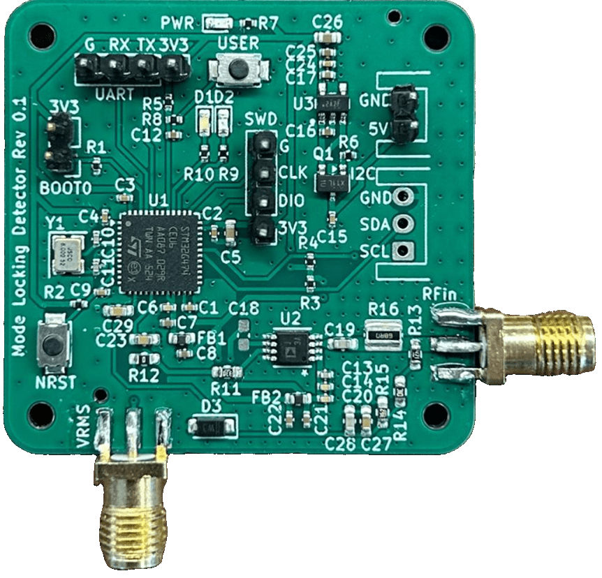
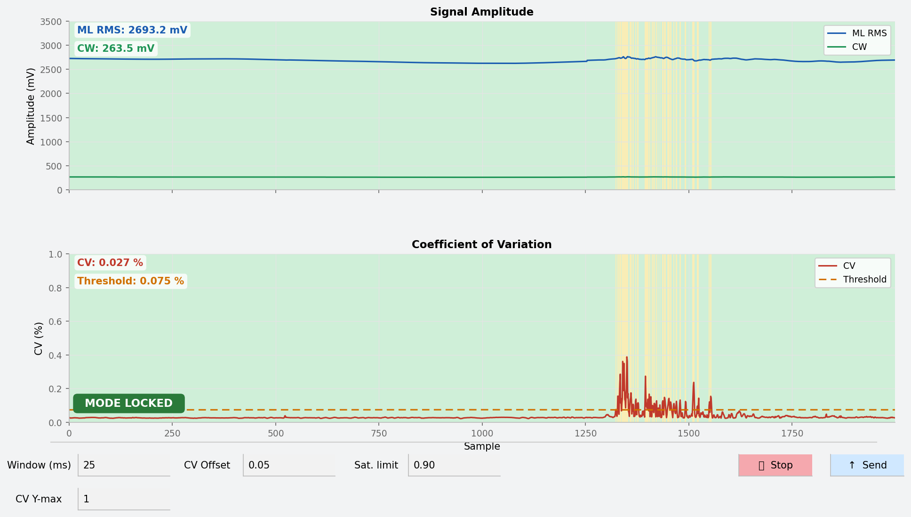
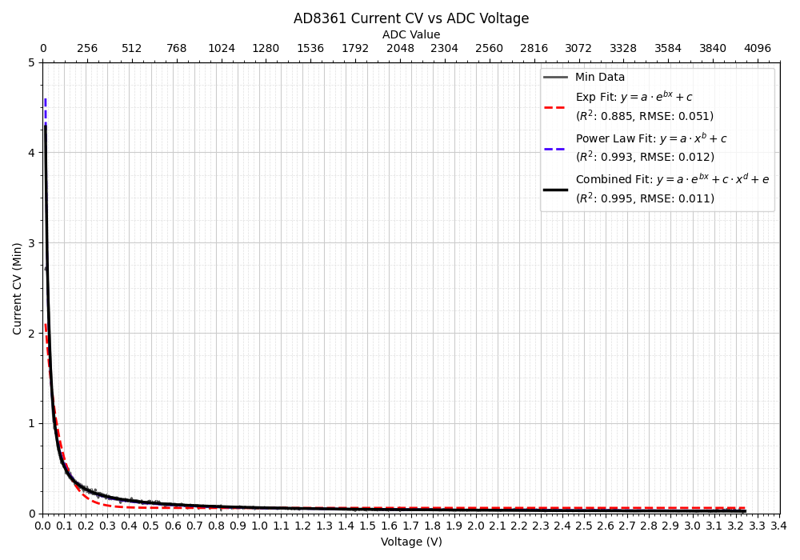
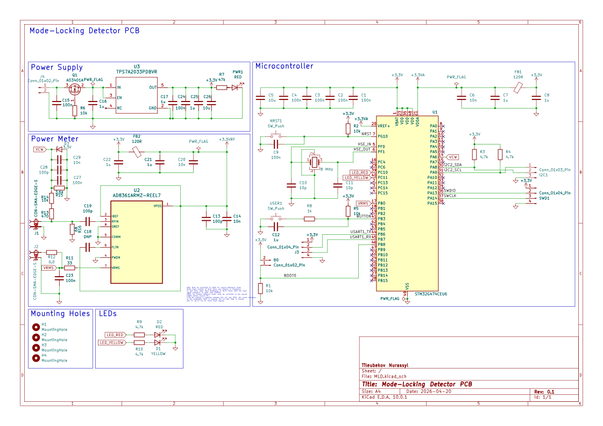
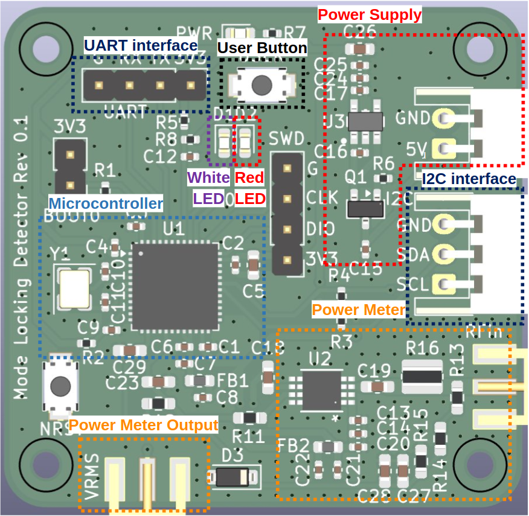

# MLDS-G4 — Mode-Locking Detection System

Real-time firmware for an **STM32G474** that classifies the operating state of an
ultrafast femtosecond laser directly from its power-meter signal, and self-calibrates
on-device. Written in bare-metal C on STM32 HAL.

The system watches the laser continuously and reports whether it is **mode-locked**,
running **CW**, **unstable**, or **initiating**, while also flagging **low-signal** and
**saturation** conditions on the power meter. State is shown with LEDs and
streamed to a host over UART.

---

## Highlights

- **STM32G474CEUx** (Cortex-M4F) @ **120 MHz**, developed on a **custom KiCAD PCB**
  (fabricated and tested).
- **Dual-ADC acquisition** over DMA: a fast ADC captures the pulse signal into a
  double-buffered ring, while a second ADC reads the CW level with 256× hardware
  oversampling.
- **Sliding-window coefficient of variation (CV = σ/μ)** as the core discriminator,
  updated in `O(1)` from a circular buffer of per-chunk sums (~1.2 KB RAM) over a
  configurable 1–1000 ms window.
- **On-device self-calibration** with a single button: sweep the laser across its
  power range, then fit the CV-vs-amplitude threshold curve on-chip with a
  hand-written **Levenberg–Marquardt** solver.
- **Persistent calibration & config** in on-chip Flash; **framed UART telemetry** and
  live re-configuration from a host; **I2C** reserved for a master controller.

---

## How it works

### Acquisition
| ADC  | Channel | Signal            | Notes                                         |
|------|---------|-------------------|-----------------------------------------------|
| ADC1 | 15      | Pulse / ML signal | 12-bit, continuous, DMA ring (2000 samples)   |
| ADC2 | 3       | CW level          | 12-bit, 256× hardware oversampling, DMA       |

ADC1 runs as a continuous circular DMA transfer. Half-transfer and transfer-complete
callbacks set a flag identifying which half of the buffer is ready; the main loop
processes that half while the DMA fills the other. An overrun counter catches any
case where the main loop can't keep up.

*Live telemetry from the host: ML RMS and CW levels (top), the coefficient of
variation against its adaptive threshold (bottom), and the resulting state. The brief
excursion above threshold is flagged as unstable before settling back to mode-locked.*

### Classification
Each buffer half feeds a sliding-window **coefficient of variation** of the signal.
The mean amplitude selects an operating regime, and the CV is compared against an
**amplitude-dependent threshold curve** (stored as a 4096-entry lookup table). The
variance is computed with an integer formulation that avoids catastrophic
cancellation, keeping the whole path real-time on the M4.

| State         | Category           | LED             |
|---------------|--------------------|-----------------|
| `MODE_LOCKED` | Laser state        | Yellow solid    |
| `CW`          | Laser state        | Off             |
| `UNSTABLE`    | Laser state        | Off             |
| `INITIATING`  | Laser state (transitional) | —       |
| `LOW_SIGNAL`  | Power-meter cond.  | Red pulse       |
| `SATURATED`   | Power-meter cond.  | Red solid       |

### On-device calibration
Because the CV threshold depends on the laser and the optical setup, the thresholds
are learned on the device:

1. **Hold** the user button and sweep the laser across its power range.
2. The firmware captures the per-amplitude CV envelope (256 bins) plus the CW
   threshold floors.
3. **Release** the button — the firmware fits a 5-parameter model
   `y = a·e^(b·x) + c·x^d + e` with an on-chip Levenberg–Marquardt solver and reports
   the fit MSE and R².
4. The fitted model and thresholds are written to Flash and take effect immediately.

*Measured CV vs. amplitude over a full power sweep. The combined model
`a·e^(bx) + c·x^d + e` (R² = 0.995) tracks the curve far better than either the
exponential or power-law term alone — which is why it's the model fit on-chip.*

### Persistence
On-chip Flash holds the CV model + CW thresholds and the runtime config, so
calibration survives power cycles. Defaults are used if Flash is empty or invalid.

---

## UART protocol

USART1 at **460800 baud, 8-N-1**, over DMA (idle-line framing).

- **Telemetry → host:** framed records (`0xAA … 0xBB`) with the RMS/CW levels, current
  CV, active threshold, and state code.
- **Config → device:** a framed record sets the sliding-window length, threshold
  offset, and saturation percentage; validated frames are applied live and persisted
  to Flash. The active config is echoed back periodically for host sync.

---

## Hardware

- **MCU:** STM32G474CEUx (Cortex-M4F, 128 KB SRAM, 512 KB Flash), clocked at 120 MHz
  from an 8 MHz HSE.
- **Board:** custom PCB designed in KiCAD (schematic + layout), fabricated and tested.
- **Front end:** AD8361 RMS power detector on an SMA RF input, TPS7A20 LDO supply.
- **I/O:** analog power-meter inputs (ADC1/ADC2), status LEDs, user button (calibration),
  USART1 to host, I2C2 reserved for a master controller.

### Schematic

### Board

*Functional blocks: microcontroller, power supply, AD8361 power meter, UART/I2C/SWD
interfaces, status LEDs, and the user button.*
